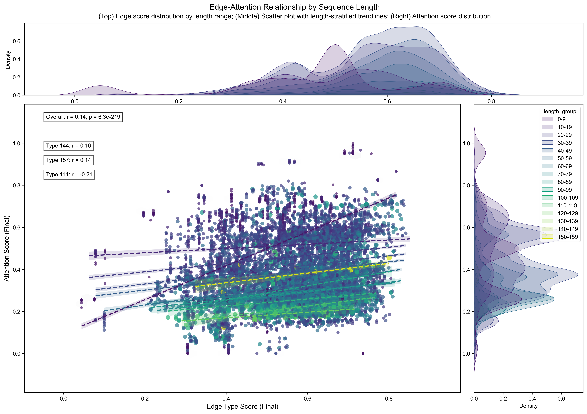
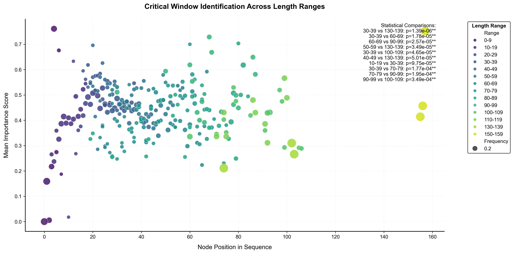
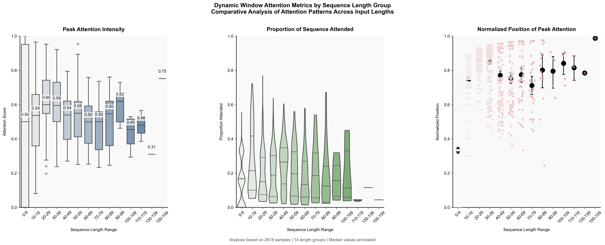
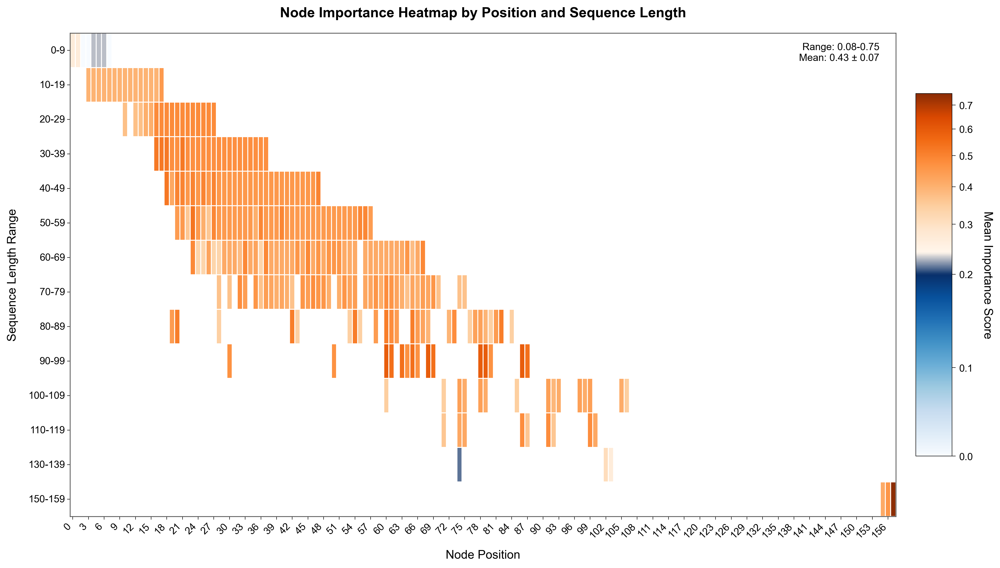
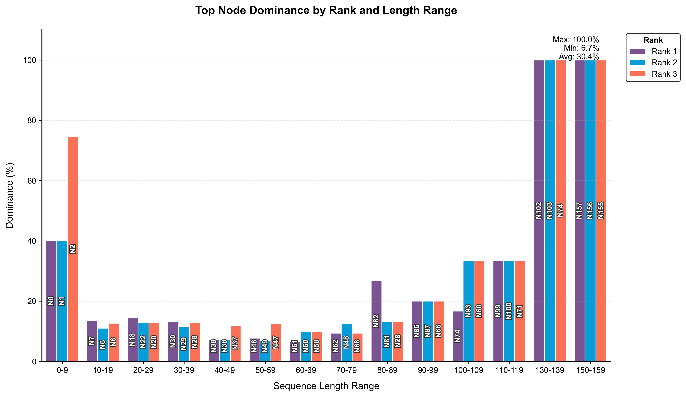
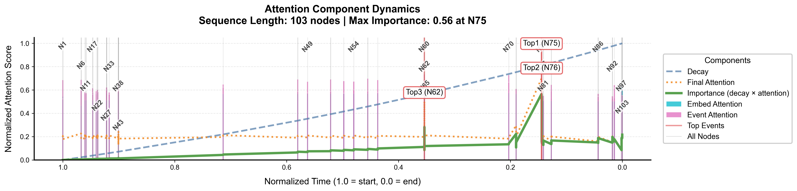
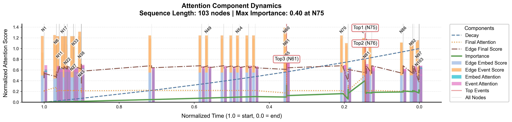

# Time-Aware and Transition-Semantic Graph Neural Networks for Interpretable Predictive Business Process Monitoring

***Unified and interpretable GNN research pipeline*** for next-event prediction in predictive business process monitoring (PBPM), combining prefix-based GCNs and full-trace  GAT attention models with time-decay dynamics and transition-aware edge semantics. Built for generalizability and multilevel interpretability.

**Authors**: Fang Wang (Florence Wong), Ernesto Damiani  

**Repository**: Code and demonstrations for the associated research article.

---
## 📖 Overview  
**[Download Preprint](https://arxiv.org/abs/XXXX.XXXXX)**  
This repository provides a collection of **Graph Neural Network (GNN)** models for **next-event prediction** in predictive business process monitoring (PBPM). The framework includes both **prefix-based GCNs** for subgraph-level modeling and **full-trace GATs** with dynamic temporal windows and transition-aware edge embeddings. A suite of interpretability visualizations is also provided.

### Key Features:
- **Full-trace attention** with time-decay to prioritize temporally relevant context  
- **Prefix-based GCNs** for localized sequence modeling and comparative benchmarking  
- **Transition-type edge embeddings** for capturing semantic relationships between events  
- **Joint prediction of sub-status and activity label** for contextual accuracy  
- **Multilevel interpretability**, including different type of visualizations
---

## 🧩 Repository Structure  

### 🔧 Core Model Files

| Model Variant | File(s) | Description |
|---------------|---------|-------------|
| **GAT-T** | `GATConv.py` | Standard full-trace GAT with local temporal differences |
| **GAT-TT** | `GATConvStatusEmb.py` | GAT-T + transition-type edge embeddings |
| **GAT-TD** | `GATConvTimeDecay.py` | GAT-T with global time-decayed attention |
| **GAT-TDTE** | `GATConvTimeDecayStatusEmb.py` | GAT-TD + transition-type edge embeddings |
| **GCN-Prefix** | `PrefixEmbeddingGCN.py` | Prefix-based GCN baseline with localized temporal context |

> Each model file includes:  
> • Graph construction and edge encoding logic  
> • Integrated attention extraction and interpretability hooks  
> • Evaluation and visualization utilities for in-notebook analysis

### 📓 Demonstration Notebooks

| Notebook | Description |
|----------|-------------|
| `GatConvCall.ipynb` | Demo for GAT-T |
| `GatConvStatusEmbCall.ipynb` | Demo for GAT-TT |
| `GatConvTimeDecayCall.ipynb` | Demo for GAT-TD |
| `GatConvTimeDecayStatusEmbCall.ipynb` | Demo for GAT-TDTE |
| `PrefixEmbeddingGCNCall.ipynb` | Demo for GCN-Prefix baseline |

### 🛠️ Data Utilities

| File | Purpose |
|------|---------|
| `DataEncoder.py` | Encodes node and edge features (activity, sub-status, time) |
| `DataProcess.ipynb` | Data preprocessing (demo: BPI12) |

> Benchmark datasets used: **BPI12, BPI12W, BPI13c, BPI13i, Helpdesk**  
> Preprocessed datasets are stored under the `output/` directory.
---

## 📂 **Data Preprocessing**

The notebook `DataProcess.ipynb` provides a complete walkthrough of the preprocessing pipeline for event logs.

### 🔄 Column Standardization

After preprocessing, the key columns are renamed for consistency:

| Original Column           | Renamed Column |
|---------------------------|----------------|
| `time:timestamp`          | `time`         |
| `case:concept:name`       | `sequence`     |
| `concept:name`            | `event_label`  |
| `lifecycle:transition`    | `status`       |

A new column `event` is created by concatenating `event_label` and `status`, representing the atomic activity used in prediction tasks.

### 🧠 Attribute Classification and Renaming

The function `classify_and_rename()` automatically:

- Identifies **sequence-level** vs. **event-level** attributes.
- Detects **categorical** and **numerical** columns.
- Applies a standardized renaming scheme:

| Attribute Type           | Prefix |
|--------------------------|--------|
| Sequence-level categorical   | `sc*`  |
| Sequence-level numerical     | `sn*`  |
| Event-level categorical      | `ec*`  |
| Event-level numerical        | `en*`  |

This structured renaming ensures compatibility with the GNN models and simplifies model input formatting.

⚠️ The model expects renamed columns (e.g., `ec1`, `en1`, `sc1`, etc.) as generated by this step.

---

## ⚙️ Model Summary

| Model | Description |
|-------|-------------|
| **GAT-T** | Full-trace GAT with standard attention over local time differences |
| **GAT-TT** | GAT-T + transition-type semantics as edge features |
| **GAT-TD** | GAT-T + time-decayed attention for dynamic temporal focus |
| **GAT-TDTE** | GAT-TD + transition-type semantics (full-featured version) |
| **GCN-Prefix** | GCN baseline with prefix subgraphs and static attention |


## 🔍 Sample Visualizations

### 🔗 Transition Attention Correlation (Global Sensitivity)
Scatter plot showing how learned edge type embeddings influence attention weights in GAT-TDTE, with clear trends across different sequence lengths and strong alignment between structural semantics and attention dynamics.



---

### 🫧 Critical Windows
Bubble plots identifies where the model consistently concentrates attention and whether these focal points vary meaningfully across different sequence lengths for GAT-TDTE and GAT-TD.



---

### 📈 Attention Summary Statistics
Aggregates attention metrics applied for GAT-TDTE and GAT-TD to summarize trends in peak intensity, attention span, and positional focus.



---

<table>
  <tr>
    <td align="center" width="50%">
      
      <div>
        <b>Attention Heatmap</b>
        <p style="text-align: justify;">
          Heatmap applied for GAT-TDTE and GAT-TD showing how attention distributes across node positions and how this distribution shifts with sequence length.
        </p>
      </div>
    </td>
    <td align="center" width="50%">
      
      <div>
        <b>Node Importance</b>
        <p style="text-align: justify;">
          Bar chart applied for GAT-TDTE and GAT-TD showing how often each node appears in the Top-3 attention ranks across sequences, revealing consistent positional dominance patterns.
        </p>
      </div>
    </td>
  </tr>
</table>


---

### 📍 Dynamic Temporal Window – Case Study
Timeline plot applied for GAT-TD of a sample trace showing how attention shifts over time.
    


---

### 🧪 Attention Composition – Case Study
Decomposed attention visualization comparing models with and without edge-type embeddings, highlighting how structural semantics reshape temporal focus in GAT-TDTE.




## 📜 Citation  

If you use this code or model, please cite the associated paper:  

```bibtex
@article{wang2025gattd,
  title={Temporal Attention GNNs with Time Decay for Interpretable Outcome Prediction in Business Process Monitoring},
  author={Wang, Fang and Damiani, Ernesto},
  journal={arXiv preprint arXiv:XXXX.XXXXX},
  year={2025}
}
